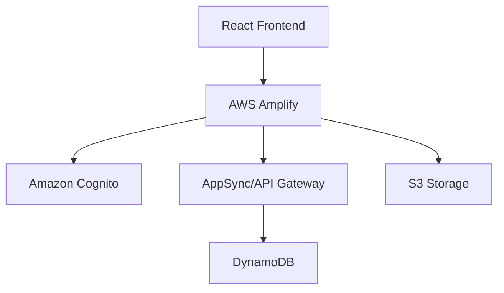

# AWS Amplify Documentation

## Overview

AWS Amplify is a complete solution for building full-stack applications on AWS. It provides tools and services for frontend and backend development.

## Key Features

- Authentication
- API (REST & GraphQL)
- Storage
- Hosting
- CI/CD
- Analytics
- Push Notifications

## Real-World Example: E-commerce Application

### Architecture



### Implementation Example

```javascript
// Initialize Amplify
import { Amplify } from 'aws-amplify';
import config from './aws-exports';
Amplify.configure(config);

// Add Authentication
import { withAuthenticator } from '@aws-amplify/ui-react';
export default withAuthenticator(App);
```

## Setup Guide

1. Install Amplify CLI

```bash
npm install -g @aws-amplify/cli
```

2. Configure Amplify

```bash
amplify configure
```

3. Create new project

```bash
amplify init
```

## Common Use Cases

- Single Page Applications (SPA)
- Mobile Applications
- Progressive Web Apps (PWA)
- Serverless Web Applications

## Best Practices

1. Use environment variables
2. Implement proper authentication
3. Follow security best practices
4. Regular backups of data
5. Monitor application metrics

## Resources

- [Official Documentation](https://docs.amplify.aws/)
- [GitHub Repository](https://github.com/aws-amplify/amplify-js)
- [Community Forum](https://discord.gg/amplify)
