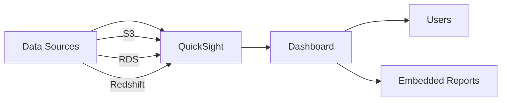

# Amazon QuickSight: Business Intelligence Service

## Overview

Amazon QuickSight is a cloud-native business intelligence (BI) service that makes it easy to create and distribute interactive dashboards and reports.

## Key Features

- Serverless architecture
- Pay-per-session pricing
- ML-powered analytics
- Embedded analytics capability
- Mobile-friendly dashboards

## Real-World Example: Sales Analytics Dashboard

### Use Case

A retail company needs to analyze sales data across multiple regions and products.

### Architecture



### Implementation Steps

1. Data Integration
   - Connect to data sources (S3, RDS, Redshift)
   - Schedule data refresh intervals

2. Data Preparation
   - Create datasets
   - Define calculated fields
   - Set up data transformations

3. Visualization
   - Create interactive charts
   - Build KPI metrics
   - Design drill-down capabilities

## Sample Dashboard Components

```
- Monthly Sales Overview
- Regional Performance
- Product Category Analysis
- Customer Segments
- Trend Analysis
```

## Best Practices

1. Optimize data models
2. Use appropriate visual types
3. Implement row-level security
4. Create reusable templates
5. Regular performance monitoring

## Cost Considerations

- Author sessions: $0.30 per session hour
- Reader sessions: $0.30 per session hour
- Enterprise edition: Additional features, custom pricing

## Security Features

- IAM integration
- Row-level security
- VPC connectivity
- Encryption at rest
- SAML 2.0 support

## References

- [AWS QuickSight Documentation](https://docs.aws.amazon.com/quicksight/)
- [AWS QuickSight Pricing](https://aws.amazon.com/quicksight/pricing/)
