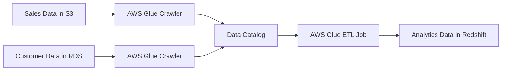

# AWS Glue Documentation

## Overview

AWS Glue is a fully managed ETL (Extract, Transform, Load) service that makes it simple to prepare and load data for analytics.

## Key Components

### 1. AWS Glue Data Catalog

- Central metadata repository
- Stores table definitions, job definitions, and other control information
- Integrates with Amazon Athena, EMR, and Redshift Spectrum

### 2. ETL Jobs

- Python or Scala based
- Auto-generated ETL code
- Serverless execution

### 3. Crawlers

- Automatically scans data sources
- Updates Data Catalog
- Infers schema and partitioning

## Real-World Example

### E-commerce Data Pipeline



### Example Use Case

An e-commerce company needs to combine:

1. Sales data from S3 (JSON format)
2. Customer data from RDS (MySQL)
3. Create analytics-ready data in Redshift

```python
# Sample Glue ETL Job
from pyspark.context import SparkContext
from awsglue.context import GlueContext
from awsglue.job import Job

glueContext = GlueContext(SparkContext.getOrCreate())

# Read sales data
sales_data = glueContext.create_dynamic_frame.from_catalog(
    database="retail",
    table_name="sales"
)

# Read customer data
customer_data = glueContext.create_dynamic_frame.from_catalog(
    database="retail",
    table_name="customers"
)

# Join datasets
joined_data = sales_data.join(
    customer_data,
    'customer_id',
    'customer_id'
)
```

## Architecture


## Best Practices

1. Use bookmarks to track processed data
2. Implement error handling and retry logic
3. Optimize job parameters for performance
4. Use job metrics for monitoring
5. Implement security best practices (encryption, IAM roles)

## Common Use Cases

- Data lake creation
- Log analytics
- Application data integration
- Data warehouse ETL
- Streaming data processing

## Cost Considerations

- Pay for resources consumed during crawler and job runs
- DPU (Data Processing Unit) hour pricing
- Data Catalog storage pricing

## Monitoring and Maintenance

- CloudWatch metrics integration
- Job run status tracking
- Runtime logs
- Auto-scaling capabilities

## Security

- IAM role-based access control
- KMS encryption support
- VPC connectivity options
- Data encryption at rest and in transit
