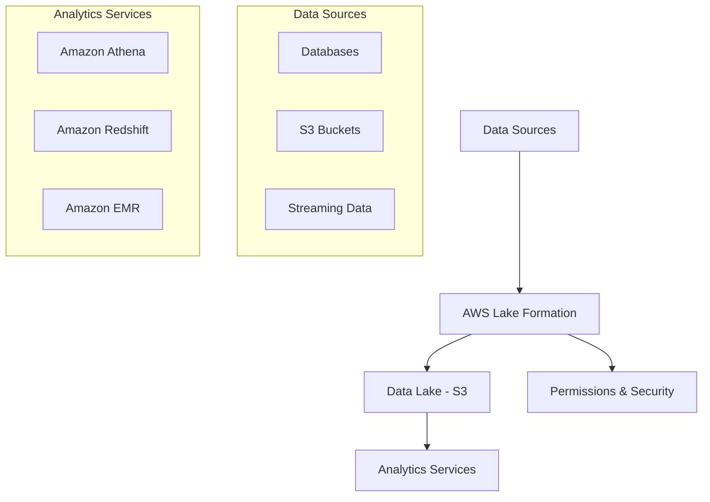

# AWS Lake Formation Guide

## Overview

AWS Lake Formation is a service that makes it easy to set up, secure, and manage your data lake. This document provides a comprehensive guide with real-world examples and architecture patterns.

## Table of Contents

- [Architecture](#architecture)
- [Real-World Example](#real-world-example)
- [Key Components](#key-components)
- [Implementation Steps](#implementation-steps)

## Architecture



## Real-World Example

Consider a retail company managing:

- Point of Sale (POS) data
- Inventory systems
- Customer behavior analytics
- Supply chain data

### Use Case Implementation

1. **Data Ingestion**
   - Store raw POS data in S3
   - Import inventory database using AWS Glue
   - Stream customer behavior data using Kinesis

2. **Data Organization**
   - Create tables and databases
   - Define data partitions
   - Implement data cataloging

3. **Security**
   - Set row-level security for regional data
   - Configure column-level permissions
   - Manage user access through IAM

## Key Components

1. **Data Catalog**
   - Central metadata repository
   - Table definitions
   - Schema versions

2. **Security Settings**
   - Fine-grained access control
   - Data encryption
   - Resource-level permissions

3. **ETL Jobs**
   - Data cleaning
   - Format conversion
   - Data validation

## Implementation Steps

1. **Setup**

```bash
# Create Lake Formation Admin
aws lakeformation create-data-lake-settings

# Register S3 bucket
aws lakeformation register-resource \
    --resource-arn arn:aws:s3:::your-bucket
```

2. **Permissions**

```bash
# Grant database permissions
aws lakeformation grant-permissions \
    --principal DataLakeAdmin \
    --permissions CREATE_DATABASE \
    --resource Database
```

3. **Data Access**

```sql
-- Example Athena query on lake data
SELECT * FROM retail_db.sales
WHERE date_partition >= '2023-01-01'
```

## Best Practices

- Implement proper data governance
- Use blueprints for repetitive workflows
- Maintain data quality checks
- Regular security audits
- Version control for schemas

## Related Services

- AWS Glue
- Amazon S3
- Amazon Athena
- Amazon Redshift
- AWS IAM

For detailed implementation guides and more examples, visit [AWS Lake Formation Documentation](https://docs.aws.amazon.com/lake-formation/).
