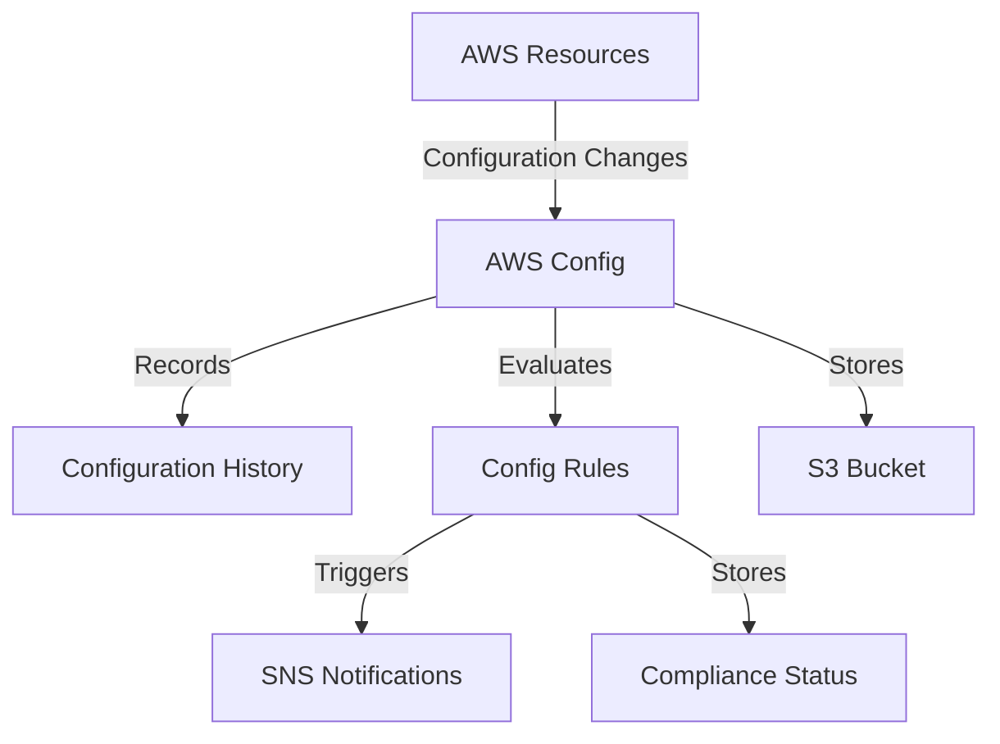

# AWS Config Documentation

## Overview

AWS Config is a service that enables you to assess, audit, and evaluate the configurations of your AWS resources. It provides continuous monitoring, records configuration changes, and enables compliance auditing.

## Key Features

- Configuration History
- Resource Relationships
- Compliance Auditing
- Security Analysis
- Resource Change Tracking

## Real-World Example

Let's consider a scenario where a company needs to ensure all their S3 buckets are encrypted and properly tagged.

### Use Case

- Monitor S3 bucket configurations
- Ensure encryption is enabled
- Track unauthorized changes
- Maintain compliance standards

## Architecture



## Implementation Steps

1. Enable AWS Config

```bash
aws configservice start-configuration-recorder \
    --configuration-recorder-name ConfigRecorder \
    --recording-group allSupported=true
```

2. Create Config Rule

```json
{
  "ConfigRuleName": "s3-bucket-encryption",
  "Source": {
    "Owner": "AWS",
    "SourceIdentifier": "S3_BUCKET_SERVER_SIDE_ENCRYPTION_ENABLED"
  },
  "Scope": {
    "ComplianceResourceTypes": [
      "AWS::S3::Bucket"
    ]
  }
}
```

## Benefits

- Continuous Monitoring
- Automated Compliance Checking
- Security Assessment
- Resource Inventory Management
- Configuration Management

## Best Practices

1. Enable multi-region tracking
2. Set up SNS notifications
3. Use AWS Config Rules
4. Regular compliance audits
5. Integrate with CloudWatch

## Cost Considerations

- Per configuration item recorded
- Per config rule evaluation
- S3 storage for configuration history

For detailed pricing, visit [AWS Config Pricing](https://aws.amazon.com/config/pricing/)

## Related Services

- AWS CloudTrail
- Amazon SNS
- Amazon S3
- AWS Lambda
- Amazon CloudWatch

## References

- [AWS Config Documentation](https://docs.aws.amazon.com/config/latest/developerguide/WhatIsConfig.html)
- [AWS Config API Reference](https://docs.aws.amazon.com/config/latest/APIReference/Welcome.html)
