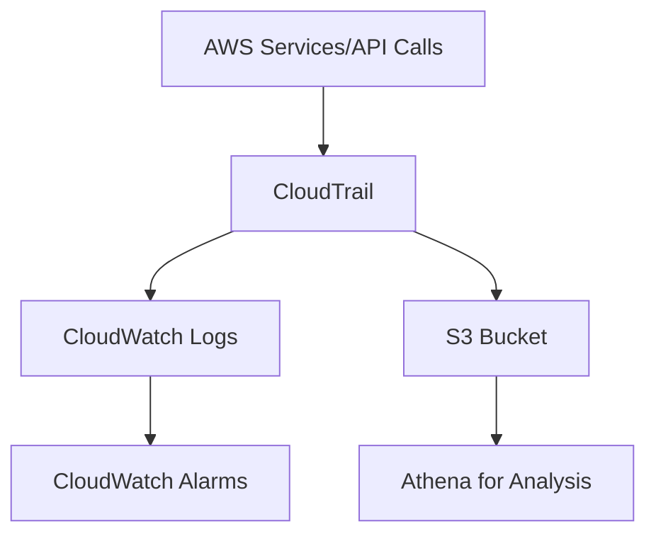

# Amazon CloudTrail Documentation

## Overview

Amazon CloudTrail is a service that enables governance, compliance, operational auditing, and risk auditing of your AWS account. It records API calls made on your account as events, including calls made by the AWS Management Console, AWS SDKs, command line tools, and other AWS services.

## Key Features

- Records AWS API calls and related events
- Logs user activity and API usage
- Enables security analysis and troubleshooting
- Supports compliance and auditing requirements

## Architecture



## Real-World Example

### Scenario: Security Incident Investigation

A company detects unauthorized access to their S3 buckets. Using CloudTrail:

1. They check CloudTrail logs and find:

```json
{
    "eventTime": "2023-06-15T10:00:00Z",
    "eventName": "GetObject",
    "userIdentity": {
        "userName": "suspicious-user"
    },
    "requestParameters": {
        "bucketName": "sensitive-data-bucket"
    }
}
```

2. Actions taken:

- Identified the source IP
- Tracked user actions
- Implemented security measures

## Setup Guide

1. Enable CloudTrail

```bash
aws cloudtrail create-trail \
    --name my-trail \
    --s3-bucket-name my-bucket
```

2. Start logging

```bash
aws cloudtrail start-logging --name my-trail
```

## Best Practices

- Enable log file validation
- Use encryption
- Configure multi-region trails
- Set up CloudWatch alarms for specific events
- Regularly review logs

## Cost Considerations

- Management events are free
- Data events and insight events are charged
- S3 storage costs apply for logs

## Related Services

- AWS CloudWatch
- Amazon S3
- AWS SNS
- Amazon Athena
