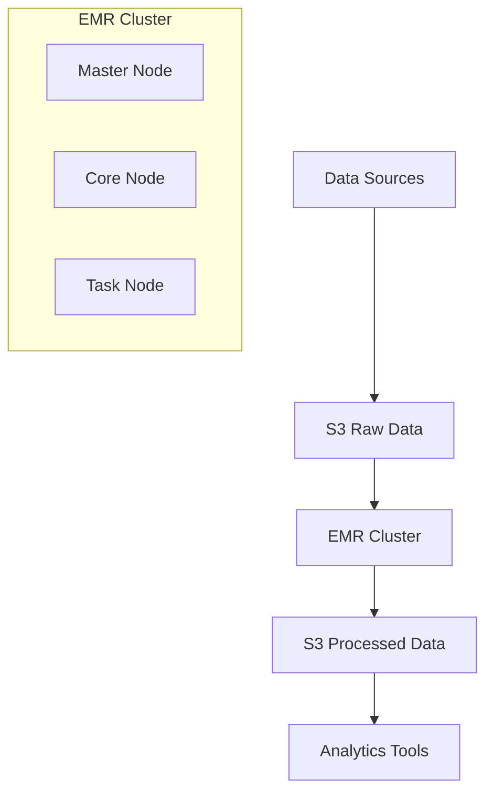

# Amazon EMR (Elastic MapReduce) Documentation

## Overview

Amazon EMR is a cloud-based big data platform that allows you to process and analyze massive amounts of data using popular open-source tools like Apache Spark, Apache Hadoop, Apache Hive, and more.

## Real-World Example

Let's consider an e-commerce company that needs to analyze customer behavior:

### Use Case: Customer Purchase Pattern Analysis

- Process daily logs of customer transactions (>1TB)
- Analyze shopping cart abandonment rates
- Generate personalized product recommendations
- Calculate customer lifetime value

## Architecture



## Key Components

### 1. Cluster Configuration

```yaml
ClusterName: "Analytics-Cluster"
InstanceGroups:
  - Master: m5.xlarge (1 node)
  - Core: m5.2xlarge (3 nodes)
  - Task: m5.large (Auto-scaling 2-10 nodes)
```

### 2. Common Applications

- Apache Spark
- Apache Hive
- Apache HBase
- Jupyter Notebooks
- Ganglia (monitoring)

## Sample Implementation

```python
# Using PySpark on EMR
from pyspark.sql import SparkSession

# Initialize Spark
spark = SparkSession.builder \
    .appName("CustomerAnalytics") \
    .getOrCreate()

# Read data from S3
df = spark.read.parquet("s3://my-bucket/customer-data/")

# Process data
results = df.groupBy("customer_id") \
    .agg({"purchase_amount": "sum"}) \
    .orderBy("sum(purchase_amount)", ascending=False)

# Save results back to S3
results.write.parquet("s3://my-bucket/processed-data/")
```

## Best Practices

1. Use Spot Instances for cost optimization
2. Implement auto-scaling policies
3. Separate storage (S3) from compute (EMR)
4. Use EMR notebooks for development
5. Enable logging and monitoring

## Cost Optimization

- Use Spot Instances for Task nodes
- Implement automatic termination
- Choose appropriate instance types
- Use EMR managed scaling

## Security

- Configure Security Groups
- Use IAM roles
- Enable encryption at rest
- Implement VPC for network isolation

## Monitoring

- CloudWatch metrics
- Ganglia interface
- Spark History Server
- EMR console monitoring

## References

- [AWS EMR Documentation](https://docs.aws.amazon.com/emr/)
- [EMR Best Practices](https://aws.amazon.com/emr/features/)
