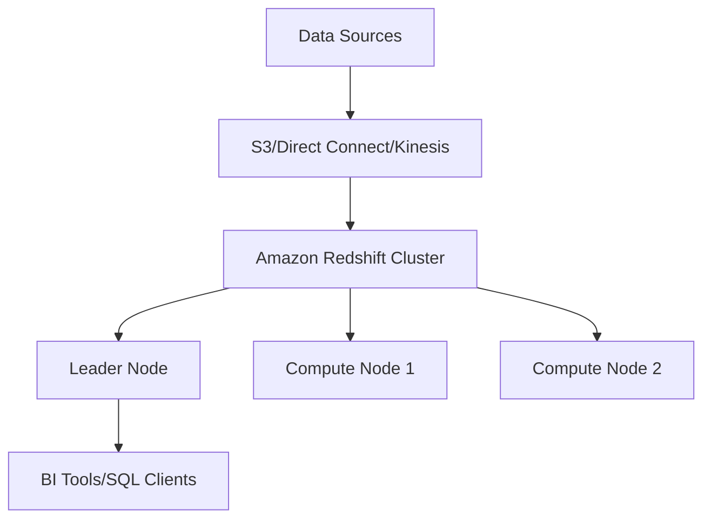

# Amazon Redshift: Data Warehousing in the Cloud

## Overview

Amazon Redshift is a fully managed, petabyte-scale data warehouse service that enables analyzing large datasets using standard SQL queries.

## Architecture



## Key Components

1. **Leader Node**
   - Manages client connections
   - Coordinates query execution
   - Optimizes query plans

2. **Compute Nodes**
   - Store data and execute queries
   - Scale from 1 to 128 nodes
   - Available in various node types (ra3, dc2)

## Real-World Example

Consider an e-commerce company processing daily sales data:

```sql
-- Create a sales table
CREATE TABLE sales (
    sale_id INT,
    product_id INT,
    sale_date DATE,
    quantity INT,
    revenue DECIMAL(10,2)
);

-- Analyze yearly revenue
SELECT 
    EXTRACT(year FROM sale_date) as year,
    SUM(revenue) as total_revenue
FROM sales
GROUP BY year
ORDER BY year;
```

## Key Features

- Automatic backups
- Encryption at rest and in transit
- Concurrent scaling
- Cross-region snapshots
- Integration with AWS services

## Performance Optimization

1. Distribution styles
2. Sort keys
3. Compression encoding
4. Vacuum and analyze operations

## Best Practices

- Use COPY command for bulk loading
- Implement proper vacuum strategy
- Choose appropriate distribution keys
- Regular maintenance windows
- Monitor query performance

## Cost Considerations

- On-demand pricing
- Reserved Instance options
- Separate charges for storage and compute
