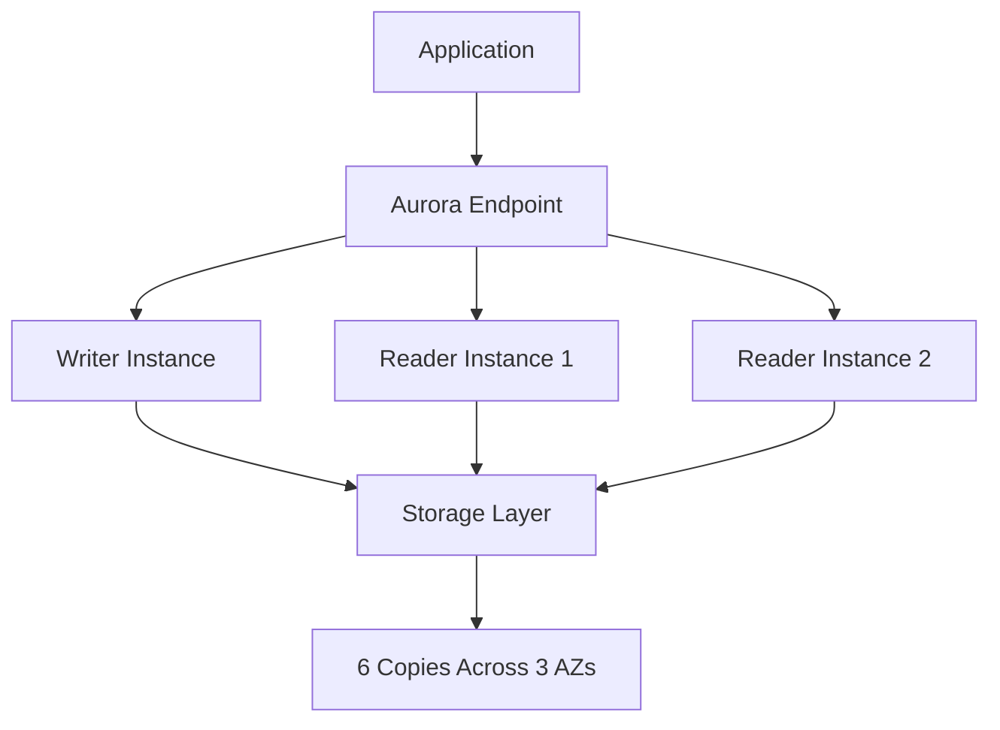

# Amazon Aurora Database

Amazon Aurora is a fully managed relational database engine that's compatible with MySQL and PostgreSQL. Here's a comprehensive guide to understanding and implementing Aurora.

## Overview

Aurora is designed for:

- High availability (99.99% uptime)
- Automatic scaling
- Built-in security
- Up to 5x performance of MySQL and 3x of PostgreSQL
- Automated backups and point-in-time recovery

## Architecture



## Real-World Example

### E-Commerce Platform Case Study

Consider an e-commerce platform with:

- 1 million daily active users
- 500,000 products
- 100,000 transactions per hour

**Implementation:**

```plaintext
Primary Instance: db.r6g.2xlarge
Read Replicas: 2 x db.r6g.xlarge
Storage: Starting with 100GB, auto-scaling enabled
Multi-AZ: Enabled for high availability
```

## Key Features

1. **Auto Scaling**
   - Storage: 10GB to 128TB
   - Compute: Based on CPU utilization

2. **Serverless Option**
   - Pay-per-use model
   - Automatic scaling from 0 to 100s of instances

3. **Global Database**
   - Cross-region replication
   - Disaster recovery with RTO < 1 minute

## Best Practices

1. **Performance**
   - Use appropriate instance sizes
   - Implement connection pooling
   - Enable Performance Insights

2. **Security**
   - Enable encryption at rest
   - Use IAM authentication
   - Regular security patching

3. **Monitoring**
   - CloudWatch metrics
   - Enhanced monitoring
   - Slow query logs

## Cost Optimization

- Use Aurora Serverless for variable workloads
- Implement automatic scaling policies
- Regular monitoring of unused resources

## Common Commands

```sql
-- Create Aurora Database
CREATE DATABASE ecommerce;

-- Enable Performance Insights
aws rds modify-db-instance \
    --db-instance-identifier mydbinstance \
    --enable-performance-insights

-- Create Read Replica
aws rds create-db-instance-read-replica \
    --db-instance-identifier aurora-read-replica \
    --source-db-instance-identifier aurora-primary
```

## References

- [AWS Aurora Documentation](https://aws.amazon.com/rds/aurora/)
- [Best Practices Guide](https://docs.aws.amazon.com/AmazonRDS/latest/AuroraUserGuide/Aurora.BestPractices.html)
- [Pricing Calculator](https://calculator.aws/#/createCalculator/AuroraMySQL)
