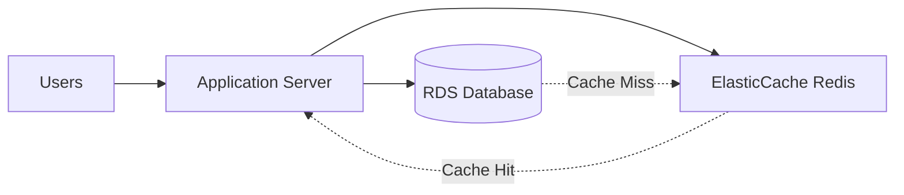

# Amazon ElasticCache Documentation

## Overview

Amazon ElasticCache is a fully managed caching service that supports Redis and Memcached. It helps improve application performance by retrieving data from high-throughput and low-latency in-memory data stores.

## Real-World Use Case: E-commerce Platform

Consider an e-commerce website with millions of daily visitors:

### Problem

- High database load during peak hours
- Slow product page loading
- Frequent product inventory checks

### Solution Architecture



## Key Features

1. **Automatic Failover**
   - Multi-AZ deployment
   - Automatic primary/replica failover

2. **Scaling Options**
   - Vertical scaling (larger nodes)
   - Horizontal scaling (more nodes)
   - Read replicas

3. **Security**
   - VPC support
   - Encryption at-rest and in-transit
   - Redis AUTH

## Implementation Example

```python
# Python Redis implementation
import redis

redis_client = redis.Redis(
    host='your-elasticache-endpoint.cache.amazonaws.com',
    port=6379,
    db=0
)

# Cache product data
def get_product(product_id):
    # Try cache first
    product = redis_client.get(f"product:{product_id}")
    
    if product is None:
        # Cache miss - get from database
        product = database.query(product_id)
        # Store in cache for 1 hour
        redis_client.setex(f"product:{product_id}", 3600, product)
    
    return product
```

## Best Practices

- Implement cache-aside pattern
- Set appropriate TTL (Time To Live)
- Monitor cache hit/miss ratio
- Configure alarm thresholds
- Use proper node sizing

## Pricing Considerations

- Pay for instance hours
- Additional costs for backup storage
- Data transfer costs
- Reserved instances for cost savings

## Performance Metrics

- Cache hit rate
- CPU Utilization
- Evictions
- Concurrent connections

## Common Use Cases

- Session management
- Database query caching
- Real-time analytics
- Gaming leaderboards
- API response caching

## Maintenance

- Automatic minor version upgrades
- Scheduled maintenance windows
- Backup and restore capabilities
- Parameter group management

For more detailed information, visit [AWS ElasticCache Documentation](https://docs.aws.amazon.com/elasticache/).
