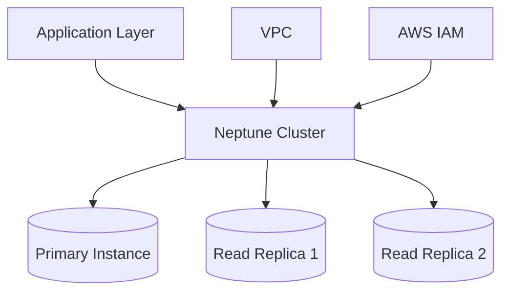

# Amazon Neptune - Graph Database Service

Amazon Neptune is a fully managed graph database service that makes it easy to build and run applications that work with highly connected datasets.

## Overview

Amazon Neptune efficiently stores and navigates graph relationships and supports two popular graph query languages:

- Apache TinkerPop Gremlin
- SPARQL

## Use Cases

1. **Social Networking**
    - Friend recommendations
    - Content sharing networks
    - Interest graphs

2. **Fraud Detection**
    - Pattern recognition
    - Identity relationships
    - Transaction links

3. **Knowledge Graphs**
    - Organization data
    - Product catalogs
    - Research networks

## Architecture Example



## Real-World Example: Social Media Platform

```gremlin
// Creating users
g.addV('person').property('name', 'John')
g.addV('person').property('name', 'Alice')

// Creating friendship relationship
g.V().has('person', 'name', 'John')
 .addE('friends').to(g.V().has('person', 'name', 'Alice'))
```

## Key Features

1. **High Availability**
    - Multi-AZ deployments
    - Automated failover
    - Read replicas

2. **Security**
    - VPC isolation
    - IAM authentication
    - encryption at rest

3. **Performance**
    - Up to 15 read replicas
    - Low latency queries
    - Cache optimization

## Getting Started

1. Create a Neptune cluster
2. Configure security groups
3. Connect using preferred query language
4. Start building your graph application

## Best Practices

- Use parameter groups for optimization
- Implement proper backup strategies
- Monitor with CloudWatch
- Use appropriate instance sizes

## Limitations

- Maximum 64TB storage
- Region availability constraints
- Query timeout limits

For detailed documentation, visit [Amazon Neptune Documentation](https://docs.aws.amazon.com/neptune/)
