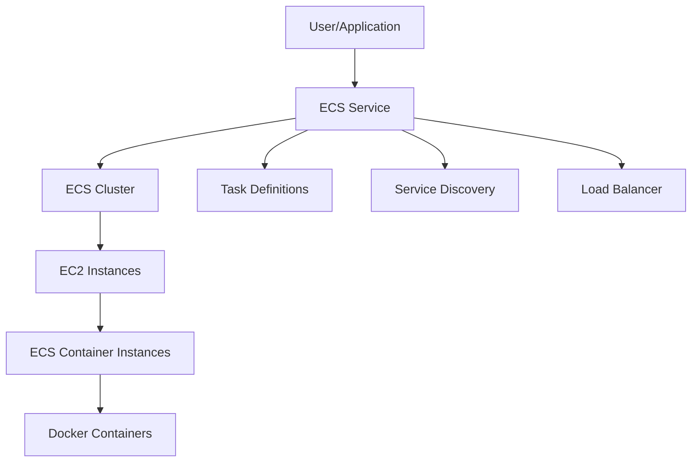

# Amazon Elastic Container Service (ECS)

## Overview

Amazon ECS is a fully managed container orchestration service that helps you run, stop, and manage Docker containers on a cluster of Amazon EC2 instances.

## Architecture



## Key Components

1. **ECS Cluster**
   - Logical grouping of EC2 instances
   - Manages container instances
   - Can use Fargate for serverless containers

2. **Task Definitions**
   - JSON files describing container configurations
   - Includes image, CPU, memory, ports, volumes

3. **ECS Service**
   - Maintains specified number of tasks
   - Handles load balancing
   - Ensures high availability

## Real-World Example

### Microservices Application

```yaml
# task-definition.json
{
  "family": "web-app",
  "containerDefinitions": [
    {
      "name": "nginx",
      "image": "nginx:latest",
      "memory": 256,
      "cpu": 256,
      "portMappings": [
        {
          "containerPort": 80,
          "hostPort": 80
        }
      ]
    }
  ]
}
```

### Deployment Steps

1. Create ECS Cluster

```bash
aws ecs create-cluster --cluster-name production
```

2. Register Task Definition

```bash
aws ecs register-task-definition --cli-input-json file://task-definition.json
```

3. Create Service

```bash
aws ecs create-service --cluster production --service-name web-app --task-definition web-app:1 --desired-count 2
```

## Best Practices

1. Use Application Load Balancer for HTTP/HTTPS traffic
2. Implement service auto-scaling
3. Monitor using CloudWatch
4. Use ECS Capacity Providers
5. Implement proper security groups

## Common Use Cases

- Web Applications
- Microservices
- Batch Processing
- CI/CD Pipelines
- API Services

## Advantages

- Fully managed service
- Integration with AWS services
- Cost-effective
- Scalable and reliable
- Supports Docker containers
- Easy deployment and updates

## Limitations

- Region-specific
- AWS-specific orchestration
- Learning curve for complex deployments

## Additional Resources

- [AWS ECS Documentation](https://docs.aws.amazon.com/ecs/)
- [ECS Workshop](https://ecsworkshop.com/)
- [ECS Best Practices](https://docs.aws.amazon.com/AmazonECS/latest/bestpracticesguide/ecs-bp.html)
