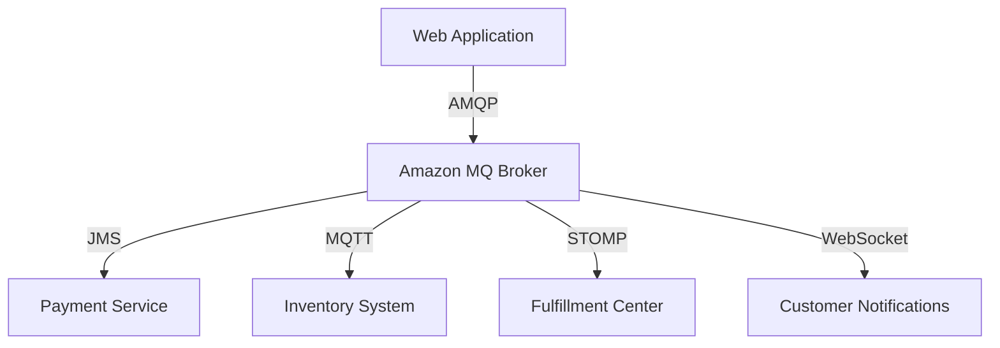

# Amazon MQ Documentation

## Overview

Amazon MQ is a managed message broker service that makes it easy to set up and operate message brokers in the cloud. It supports industry-standard APIs and protocols like JMS, NMS, AMQP, STOMP, MQTT, and WebSocket.

## Real-World Example

Let's consider an e-commerce application:

### Use Case: Order Processing System

- Customer places order through web interface
- Order details sent to payment processing service
- Inventory system updated
- Notification sent to fulfillment center
- Order status updates sent to customer

## Architecture



## Key Components

1. **Broker Instance Types**
   - Single-instance broker (development)
   - Active/standby broker (production)

2. **Network Configuration**
   - VPC
   - Security groups
   - Private/Public access

3. **Protocols Supported**
   - AMQP (1.0)
   - MQTT (3.1.1)
   - STOMP (1.0, 1.1, 1.2)
   - WebSocket
   - OpenWire

## Sample Configuration

```yaml
AmazonMQ:
  BrokerName: MyProductionBroker
  EngineType: ActiveMQ
  EngineVersion: 5.16.5
  HostInstanceType: mq.m5.large
  DeploymentMode: ACTIVE_STANDBY_MULTI_AZ
  AutoMinorVersionUpgrade: true
  PubliclyAccessible: false
```

## Best Practices

1. Use Active/Standby for production workloads
2. Implement proper security groups
3. Enable encryption at rest
4. Monitor broker metrics
5. Set up proper message expiry
6. Implement dead letter queues

## Monitoring

- CloudWatch metrics
- Broker and queue-level monitoring
- Performance metrics
- Connection monitoring

## Security

- TLS encryption in transit
- KMS encryption at rest
- IAM authentication
- Security group controls

## Cost Considerations

- Instance type selection
- Message storage
- Data transfer
- High availability configuration

For more information, visit [Amazon MQ Documentation](https://docs.aws.amazon.com/amazon-mq/)
