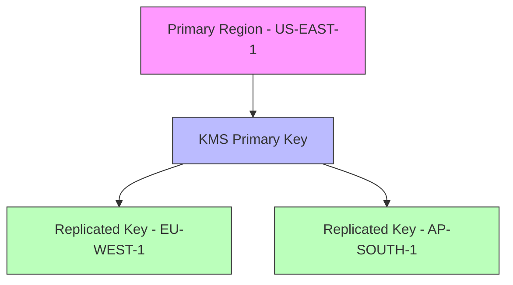

# AWS KMS Multi-Region Keys Setup

## Overview

Multi-Region keys in AWS KMS are sets of interoperable KMS keys in different AWS Regions that share the same key material. This enables cross-region encryption and decryption operations.

## Architecture Diagram



## Real-World Example: Cross-Region Backup Solution

### Use Case

A financial company needs to:

- Encrypt sensitive data in US-East-1
- Maintain encrypted backups in EU-West-1
- Process data locally in both regions
- Ensure regulatory compliance

### Implementation Steps

1. **Create Primary Key**

```bash
aws kms create-key \
    --multi-region \
    --region us-east-1 \
    --description "Multi-region primary key for financial data"
```

2. **Replicate to Secondary Region**

```bash
aws kms replicate-key \
    --primary-key-arn arn:aws:kms:us-east-1:111122223333:key/mrk-1234abcd \
    --replica-region eu-west-1
```

3. **Encrypt Data Using Primary Key**

```bash
aws kms encrypt \
    --key-id mrk-1234abcd \
    --plaintext "Sensitive Data" \
    --region us-east-1
```

4. **Decrypt in Secondary Region**

```bash
aws kms decrypt \
    --ciphertext-blob fileb://encryptedData \
    --region eu-west-1
```

## Benefits

- Seamless cross-region encryption/decryption
- Reduced latency for regional operations
- Simplified disaster recovery
- Consistent key material across regions

## Best Practices

1. Use tags for tracking multi-region keys
2. Implement proper IAM policies
3. Monitor key usage with CloudTrail
4. Regular key rotation
5. Backup key metadata

## Security Considerations

- Each replicated key maintains independent key policies
- Authorization must be configured per region
- CloudTrail logs are region-specific
- Compliance with data sovereignty requirements

## Cost Implications

- Monthly fee for each active key
- Additional charges for API requests
- Data transfer costs between regions
