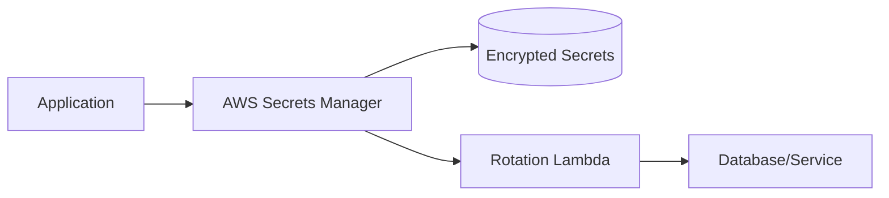

# AWS Secrets Manager: Comprehensive Guide

## Overview

AWS Secrets Manager helps you protect secrets needed to access your applications, services, and IT resources. This service enables you to easily rotate, manage, and retrieve database credentials, API keys, and other secrets throughout their lifecycle.

## Key Features

- Centralized secrets management
- Fine-grained access control
- Automatic rotation
- Encryption at rest and in transit
- Integration with AWS services

## Architecture



## Real-World Example

### 1. Database Credentials Management

```python
import boto3
import json

def get_database_credentials():
    session = boto3.session.Session()
    client = session.client('secretsmanager')
    
    secret_name = "prod/db/credentials"
    response = client.get_secret_value(SecretId=secret_name)
    secret = json.loads(response['SecretString'])
    
    return {
        'username': secret['username'],
        'password': secret['password'],
        'host': secret['host']
    }
```

### 2. API Key Storage Example

```json
{
    "api_key": "abcd1234xyz",
    "api_secret": "efgh5678pqr",
    "environment": "production"
}
```

## Best Practices

1. Use resource-based policies
2. Implement least privilege access
3. Enable CloudTrail logging
4. Use tags for organization
5. Regularly rotate secrets

## Common Use Cases

- RDS database credentials
- OAuth tokens
- API keys
- SSH keys
- SSL/TLS certificates

## Cost Considerations

- Pay for secrets stored
- Pay for API calls
- Additional costs for rotation

## Security Recommendations

- Enable encryption at rest
- Use VPC endpoints
- Implement proper IAM policies
- Monitor access through CloudTrail
- Use AWS KMS for encryption

## Integration Examples

- AWS Lambda
- Amazon RDS
- Amazon ECS
- AWS CodeBuild
- AWS CloudFormation

## Additional Resources

- [AWS Secrets Manager Documentation](https://docs.aws.amazon.com/secretsmanager/)
- [AWS SDK Examples](https://docs.aws.amazon.com/code-samples/latest/catalog/code-catalog-python-example_code-secretsmanager.html)
- [Best Practices Guide](https://docs.aws.amazon.com/secretsmanager/latest/userguide/best-practices.html)
