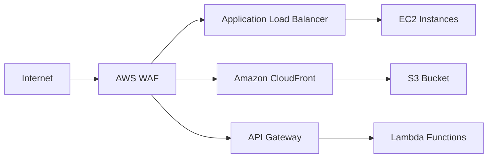

# Amazon WAF (Web Application Firewall)

## Overview

Amazon WAF is a web application firewall that helps protect web applications from common web exploits and attacks. It gives you control over which traffic to allow or block to your web applications by defining customizable security rules.

## Key Features

- Protection against common web attacks (SQL injection, XSS)
- IP address filtering
- Geo-matching/blocking
- Rate-based rules for DDoS protection
- Custom rule creation
- Real-time metrics and logging

## Architecture Example



## Real-World Example

Consider an e-commerce website that needs protection:

### WAF Rule Set Example

```json
{
    "Rules": [
        {
            "Name": "BlockSQLInjection",
            "Priority": 1,
            "Action": "BLOCK",
            "Statement": {
                "SQLInjectionMatchStatement": {
                    "FieldToMatch": {
                        "QueryString": {}
                    },
                    "TextTransformations": [{
                        "Priority": 1,
                        "Type": "URL_DECODE"
                    }]
                }
            }
        }
    ]
}
```

## Common Use Cases

1. **E-commerce Protection**
   - Rate limiting to prevent scraping
   - Blocking malicious bots
   - Protecting checkout forms

2. **API Security**
   - Input validation
   - Token enforcement
   - Request size limiting

3. **Content Management Systems**
   - Login protection
   - Comment spam prevention
   - Admin panel security

## Best Practices

1. Start in Count mode before blocking
2. Use logging for analysis
3. Implement rate-based rules
4. Regular rule updates
5. Use AWS Managed Rules

## Monitoring and Maintenance

- CloudWatch integration
- Kinesis Firehose logging
- Regular rule review
- Security analytics

## Pricing

- Pay per rule
- Pay per request
- Additional charges for optional features

## Integration Examples

```bash
# AWS CLI example to create a WAF rule
aws waf create-rule \
    --name "MyWAFRule" \
    --metric-name "MyWAFMetric" \
    --region us-east-1
```

For more information, visit [AWS WAF Documentation](https://aws.amazon.com/waf/)
