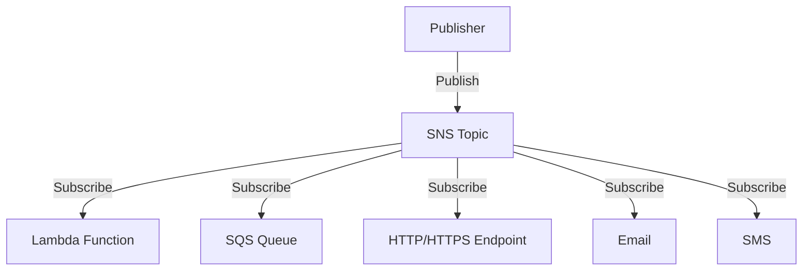

# Amazon Simple Notification Service (SNS)

## Overview

Amazon SNS is a fully managed pub/sub messaging service that enables decoupled communication between distributed systems, microservices, and serverless applications.

## Architecture



## Key Features

- Message filtering
- Message fanout
- Multiple protocols support
- Server-side encryption
- Cross-region delivery
- Dead-letter queues

## Real-World Example: E-commerce Order Processing

### Scenario

An e-commerce platform needs to notify multiple services when a new order is placed.

### Implementation

```python
import boto3

# Create SNS client
sns = boto3.client('sns')

# Publish order update
def publish_order_update(order_id, status):
    message = {
        'order_id': order_id,
        'status': status,
        'timestamp': '2023-11-14T10:00:00Z'
    }
    
    response = sns.publish(
        TopicArn='arn:aws:sns:region:account-id:OrderUpdates',
        Message=str(message),
        Subject=f'Order {order_id} {status}'
    )
    return response
```

### Subscribers

1. **Inventory Service** - Updates stock levels
2. **Shipping Service** - Initiates delivery process
3. **Customer Email** - Sends order confirmation
4. **Analytics Service** - Records order metrics

## Best Practices

1. Use FIFO topics for ordered message delivery
2. Implement retry mechanisms
3. Monitor delivery metrics
4. Use IAM roles for access control
5. Enable encryption for sensitive data

## Cost Considerations

- Pay per million API requests
- Additional charges for SMS/Email delivery
- Data transfer costs apply

## Additional Resources

- [AWS SNS Documentation](https://docs.aws.amazon.com/sns/latest/dg/welcome.html)
- [SNS Pricing](https://aws.amazon.com/sns/pricing/)
- [AWS SDK Examples](https://docs.aws.amazon.com/code-samples/latest/catalog/code-catalog-python-example_code-sns.html)
