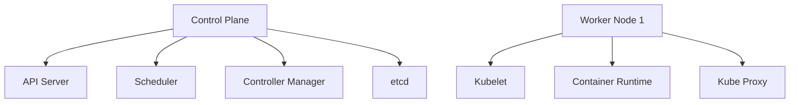

# Kubernetes Documentation

## Overview

Kubernetes (K8s) is an open-source container orchestration platform that automates the deployment, scaling, and management of containerized applications.

## Architecture



### Components

1. **Control Plane**
   - API Server: Front-end for Kubernetes API
   - Scheduler: Assigns pods to nodes
   - Controller Manager: Maintains cluster state
   - etcd: Distributed key-value store

2. **Worker Nodes**
   - Kubelet: Node agent
   - Container Runtime: (Docker/containerd)
   - Kube Proxy: Network proxy

## Real-World Example

### E-Commerce Application Deployment

```yaml
# web-deployment.yaml
apiVersion: apps/v1
kind: Deployment
metadata:
  name: online-store
spec:
  replicas: 3
  selector:
    matchLabels:
      app: web-store
  template:
    metadata:
      labels:
        app: web-store
    spec:
      containers:
      - name: frontend
        image: web-store:1.0
        ports:
        - containerPort: 80
```

## Common Commands

```bash
# Create deployment
kubectl create -f web-deployment.yaml

# Scale application
kubectl scale deployment online-store --replicas=5

# View pods
kubectl get pods
```

## Best Practices

1. Use namespaces for isolation
2. Implement resource limits
3. Use rolling updates
4. Monitor cluster health
5. Implement security policies

## Additional Resources

- [Official Kubernetes Documentation](https://kubernetes.io/docs/)
- [Kubernetes GitHub Repository](https://github.com/kubernetes/kubernetes)
